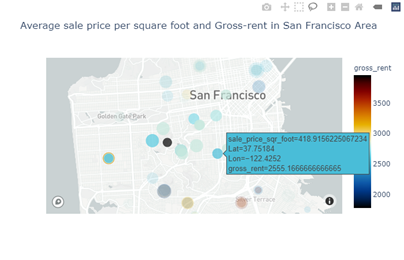
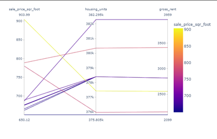
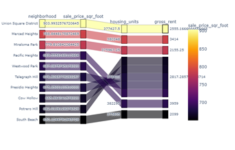
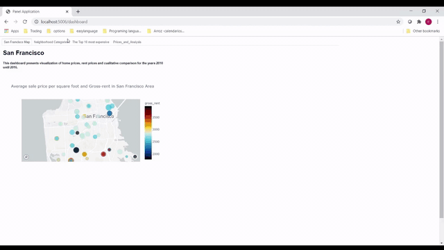

# rental_analysis_w_pyviz

____

## San Francisco Dashboard Tool:

The San Francisco dashboard tool is composed of four tabs, fed with information related to sales prices, gross monthly rent databases, number of housing units per neighborhood, as well as the coordinates of each neighborhood. 

The tabs are named: San Francisco map, Neighborhood Categories, The top 10 most expensive and Price & Analysis. on each tab analysis tools offers a different perspective or view of San Francisco area.

 

The San Francisco Map tab, offers an area map view, with colors ranging from blue to red (low to high) gross rent. The map can be interactively zoomed in/out and hovering above each circle, displays a small window with gross rent and price per square feet information.

Neighborhood Categories tab, reports 2 different views of the housing market: the top chart displays relationships between price per square feet, the number of housing units and the rent for the top 10 neighborhoods. while the bottom, expands the view including the neighborhood names. The different columns on the bottom chart can be dragged up or down to compare to prices from other neighborhoods, housing, etc.

The top 10 more expensive tab, offers two different views of the housing market in the area. the bar chart on the left reveals an increase of the numbers of houses per year, while the chart on the right reveals, the prices and names of the ten most expensive neighborhoods on the same time period. Both charts can be hovered to display details on each bar, can be zoomed in or out, saved and refreshed. 

Finally the Prices_and Analysis tab presents price changes over the years on each neighborhood. To display the desired neighborhood data, drop down the menu and select the neighborhood that wants to be analyzed (note that all the neighborhood data is available).

### San Francisco Dashboard in action: 

___

### Sources:

San Francisco "gif" was prepared with pictures generously donated from these photographers (available on Unsplash.com):

[1] (https://unsplash.com/photos/HksFlo1t8iA?utm_source=unsplash&utm_medium=referral&utm_content=creditShareLink)

[2] (https://unsplash.com/photos/msH0FiGGhmk?utm_source=unsplash&utm_medium=referral&utm_content=creditShareLink)

[3] (https://unsplash.com/photos/AFlG5jpMvYg?utm_source=unsplash&utm_medium=referral&utm_content=creditShareLink)

[4] (https://unsplash.com/photos/102abqkKhbY?utm_source=unsplash&utm_medium=referral&utm_content=creditShareLink)

[5] (https://unsplash.com/photos/OoafRJlfhxc?utm_source=unsplash&utm_medium=referral&utm_content=creditShareLink)

[6] (https://unsplash.com/photos/kn5i4gUyhYM?utm_source=unsplash&utm_medium=referral&utm_content=creditShareLink)

[7] (https://unsplash.com/photos/9RKRF1gc8CA?utm_source=unsplash&utm_medium=referral&utm_content=creditShareLink)